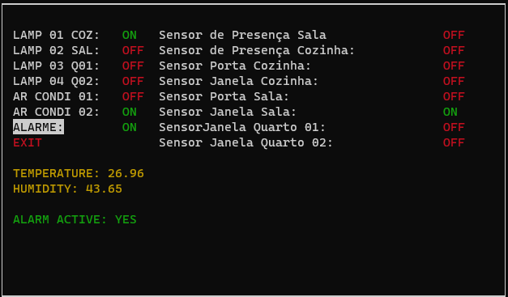

# FSE - Projeto 2 - Automação

O projeto visa construir um recurso de automação residencial distribuida. Há um servidor central que apresenta um
menu para o usuário, no qual ele pode decidir quais dispositivos quer acionar, monitorar os sensores, e ativar a função alarme. E há também um servidor
distribuido, que recebe as requisições do central e interage diretamente com os dispositivos, além de ter também a função de atualizar a central sobre alterações nos sensores.

A funcionalidade de alarme se dá da seguinte forma, se o usuário ativar o alarme a partir do menu, então ele tocará caso algum dos sensores perceba uma alteração.

### Aluno: Marcos Nery Borges Júnior - 170017885

## Execução

- **Linguagem:** C
- **Instruções de execução:**

1. Clonar o repositório em ambos os servidores, executando `git clone https://github.com/MarcosNBJ/fse_home_automation.git`
2. Ir para o servidor distribuido e navegar até o diretório `distribuido`
3. Rodar os comandos `make` e `make run`
4. Ir para o servidor central e navegar até o diretório `central`
5. Rodar os comandos `make` e `make run`

- **Instruções de uso:**
  Assim que executado, aparecerá um menu de opções no servidor central. Basta utilizar o menu para interagir com os dispositivos e ver as informações sendo atualizadas

## Screenshots

